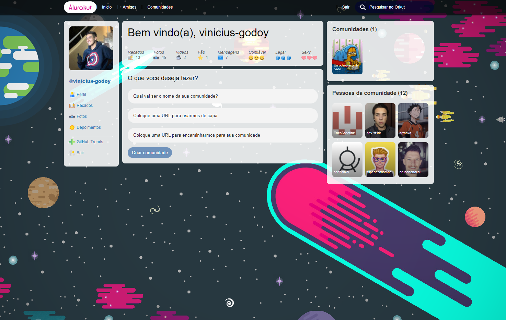

# Alurakut

Projeto da Imersão React da Alura para aprender e se aprofundar em conceitos de frontend e nos frameworks React e Next.js fazendo uma versão própria do Orkut, contém componentes próprios e uso de States e Hooks.



## Progresso

- [x] Aula 1 - Componentes com React, Styled Components e NextJS
- [x] Aula 2 - React, State e o primeiro Formulário
- [ ] Aula 3
- [ ] Aula 4
- [ ] Aula 5

## Desafios Cumpridos

- [x] Modificar valores da barra de ícones;
- [x] Adicionar um novo campo para o link da comunidade específica;
- [x] Passar as informações do usuário para o componente do menu;
- [x] Validar Campos do formulário e implementar imagens aleatórias do picsum;
- [x] Limitar Componente ProfileRelationsBoxWrapper para 6 itens;
- [x] Customizar Tema e Trocar Imagem de Fundo;
- [x] Fazer um README melhor;

## Site em Produção

Deploy feito no site [Vercel ](https://vercel.com) **(Clique para acessar)**:

[](https://alurakut-vinicius-godoy.vercel.app/)

## Como Usar e Comandos

Projeto criado com o comando:

```bash
npx create-next-app --example with-styled-components with-styled-components-app
# or
yarn create next-app --example with-styled-components with-styled-components-app
```

Para testar basta baixar e executar o comando:

```bash
yarn dev
```
